# 🎛️ PLC-FastTrack

> An interactive, fast-track course based on **_Programmable Logic Controllers, 5th Edition_** by W. Bolton (Newnes, 2009).
>
> **Mission:** Move beyond passive reading. In 6 weeks, go from zero PLC knowledge to designing, documenting, and debugging IEC 61131-3 programs with confidence.

---

## 📜 Why This Repo Exists

Bolton's book is a fantastic foundation — 398 pages covering architecture, the five IEC 61131-3 languages, timers, counters, safety, and fault diagnosis. But reading isn't doing. This repo turns the book into:

- **6 sprints** of structured study (one per week)
- **Cheat sheets** that compress each chapter to one page
- **Interactive tools** (Streamlit + Gradio) for scan cycles, number bases, timers
- **Challenge labs** that auto-grade your structured text submissions
- **Flashcards** (Anki + Obsidian) for spaced-repetition retention
- **Visual assets** (Mermaid + Excalidraw) you can edit and remix

---

## 🗺️ Course Map

```mermaid
flowchart LR
    Start([📚 Start Here]) --> S0[Sprint 0<br/>Orientation]
    S0 --> S1[Sprint 1<br/>Architecture & I/O<br/>Ch. 1–2]
    S1 --> S2[Sprint 2<br/>Digital Foundations<br/>Ch. 3–4]
    S2 --> S3[Sprint 3<br/>Ladder & FBD<br/>Ch. 5]
    S3 --> S4[Sprint 4<br/>IL, ST, SFC<br/>Ch. 6]
    S4 --> S5[Sprint 5<br/>Timers, Counters,<br/>Registers<br/>Ch. 7–12]
    S5 --> S6[Sprint 6<br/>Design & Safety<br/>Ch. 13–14]
    S6 --> Cap[🏆 Capstone<br/>Burner Start-up<br/>Sequence]

    style Start fill:#0f172a,color:#fff
    style Cap fill:#22c55e,color:#fff
    style S1 fill:#3b82f6,color:#fff
    style S2 fill:#3b82f6,color:#fff
    style S3 fill:#f59e0b,color:#fff
    style S4 fill:#f59e0b,color:#fff
    style S5 fill:#a855f7,color:#fff
    style S6 fill:#ef4444,color:#fff
```



---

## 🏃 The Six Sprints

| # | Sprint | Bolton Chapters | Core Concept |
|---|--------|-----------------|--------------|
| 1 | [Architecture & I/O](sprints/01-architecture-and-io/) | 1–2 | A PLC is a hardened computer that scans inputs, runs logic, updates outputs. |
| 2 | [Digital Foundations](sprints/02-digital-foundations/) | 3–4 | PLCs think in bits — fluency in binary, octal, hex, and BCD is mandatory. |
| 3 | [Ladder & FBD](sprints/03-ladder-and-fbd/) | 5 | Ladder logic is graphical Boolean algebra disguised as a relay schematic. |
| 4 | [IEC 61131-3 Languages](sprints/04-iec-61131-languages/) | 6 | Five languages, one standard — pick the right tool for each part of the program. |
| 5 | [Timers, Counters, Registers](sprints/05-timers-counters-registers/) | 7–12 | Real automation is mostly about time, count, and memory. |
| 6 | [Design & Safety](sprints/06-program-design-and-safety/) | 13–14 | Working code is easy. Safe, debuggable, maintainable code is engineering. |

Plus the **[Capstone](sprints/07-capstone/)** — a complete burner start-up sequence in SFC.

---

## ⚡ Quick Start

1. **Fork this repo** so you can track your progress in your own copy.
2. Open an Issue from the `sprint-progress.md` template — one for each sprint.
3. Start with **[Sprint 0: Orientation](sprints/00-orientation/)** to take the pre-assessment.
4. Work one sprint per week. Each sprint = ~5–7 hours.
5. Submit lab solutions as PRs. The CI auto-grades structured text against test vectors.
6. Drop into **Discussions** when you get stuck or want to share a slick rung.

---

## 🧰 What's In The Box

```
plc-fasttrack/
├── sprints/              # The six-week curriculum
├── visuals/              # Mermaid, Excalidraw, infographics
├── interactive-tools/    # Streamlit + Gradio simulators
├── workbooks/            # Jupyter notebooks
├── challenge-labs/       # Auto-graded structured text labs
├── flashcards/           # Anki deck + Obsidian markdown
├── reference/            # Glossary, quickref, manufacturer mapping
└── docs/                 # GitHub Pages source
```

---

## 🌐 Live Course Site

GitHub Pages renders this as a browsable course at **`https://<your-username>.github.io/plc-fasttrack/`** with embedded simulators and a progress leaderboard.

---

## 🛠️ Stack

- **Markdown + Mermaid** for content (renders natively on GitHub)
- **Streamlit / Gradio** for interactive tools
- **Jupyter** for workbooks
- **Python** for the auto-grader and Streamlit apps
- **Anki + Obsidian** for flashcards
- **GitHub Actions** for the daily-challenge bot and lab CI
- **GitHub Pages (MkDocs Material)** for the public course site

---

## 🤝 Contributing

See [CONTRIBUTING.md](CONTRIBUTING.md). PRs welcome for additional labs, manufacturer translations, and bug fixes in the auto-grader.

---

## 📚 Source Text

Bolton, W. (2009). *Programmable Logic Controllers* (5th ed.). Newnes / Elsevier. ISBN: 978-1-85617-751-1.

This repo is a **study companion** — it does not reproduce the book. You'll need a copy of Bolton to follow along.

---

## ⚖️ License

MIT — see [LICENSE](LICENSE).
