```mermaid
flowchart LR
    Start([📚 Start]) --> S0[Sprint 0<br/>Orientation]
    S0 --> S1[Sprint 1<br/>Architecture & I/O]
    S1 --> S2[Sprint 2<br/>Digital]
    S2 --> S3[Sprint 3<br/>Ladder & FBD]
    S3 --> S4[Sprint 4<br/>IEC Languages]
    S4 --> S5[Sprint 5<br/>Timers & Counters]
    S5 --> S6[Sprint 6<br/>Design & Safety]
    S6 --> Cap[🏆 Capstone<br/>Burner Sequence]

    classDef sprint fill:#ede9fe,stroke:#7c3aed,stroke-width:1.5px,color:#1f2937;
    classDef cap fill:#f59e0b,stroke:#b45309,stroke-width:2px,color:#1c1917;
    class S0,S1,S2,S3,S4,S5,S6 sprint;
    class Cap cap;
```

---
hide:
  - navigation
  - toc
---

  

     RUN MODE · LIVE COURSE
    <h1>Become a PLC engineer in 6 sprints, not 6 months.</h1>
    
PLC-FastTrack turns Bolton's <em>Programmable Logic Controllers</em> into an interactive curriculum — animated infographics, in-browser simulators, auto-graded labs, and a capstone that runs real Structured Text on a virtual factory floor.

    

      <a class="plc-btn plc-btn--primary" href="../sprints/00-orientation/README.md">▶ Start Sprint 0</a>
      <a class="plc-btn plc-btn--ghost" href="../interactive-tools/car-factory-simulator/index.html">🚗 Try the factory sim</a>
    

  

  

    0
    Sprints + Capstone
  

  

    0
    Challenge labs · auto-graded
  

  

    0
    In-browser simulators
  

  

    0
    Hours to confident IEC 61131-3
  

<h2 class="plc-section-title">The Sprint Roadmap</h2>

  <a class="plc-step" data-sprint-id="s0" href="../sprints/00-orientation/README.md">
    Orientation
    Pre-assessment · Tooling
  </a>
  <a class="plc-step" data-sprint-id="s1" href="../sprints/01-architecture-and-io/README.md">
    Architecture &amp; I/O
    Bolton Ch. 1–2
  </a>
  <a class="plc-step" data-sprint-id="s2" href="../sprints/02-digital-foundations/README.md">
    Digital Foundations
    Bolton Ch. 3–4
  </a>
  <a class="plc-step" data-sprint-id="s3" href="../sprints/03-ladder-and-fbd/README.md">
    Ladder &amp; FBD
    Bolton Ch. 5
  </a>
  <a class="plc-step" data-sprint-id="s4" href="../sprints/04-iec-61131-languages/README.md">
    IEC 61131-3 Languages
    Bolton Ch. 6
  </a>
  <a class="plc-step" data-sprint-id="s5" href="../sprints/05-timers-counters-registers/README.md">
    Timers · Counters · Registers
    Bolton Ch. 7–12
  </a>
  <a class="plc-step" data-sprint-id="s6" href="../sprints/06-program-design-and-safety/README.md">
    Design &amp; Safety
    Bolton Ch. 13–14
  </a>
  <a class="plc-step plc-step--capstone" data-sprint-id="cap" href="../sprints/07-capstone/README.md">
    Capstone — Burner Sequence
    Synthesis · SFC
  </a>

> 💡 **Tip** · `Alt`-click any step above to mark it complete. Your progress lives in the browser so the rail stays accurate across visits.

<h2 class="plc-section-title">How a PLC Thinks — in 4 steps</h2>

  

    <strong>1 · Read inputs</strong>
    Sensors, buttons, limit switches snapshotted into the input image table.
  

  

    <strong>2 · Execute logic</strong>
    Ladder / ST / SFC runs top-to-bottom against the input image.
  

  

    <strong>3 · Update outputs</strong>
    Coils, lamps, valves driven from the output image table.
  

  

    <strong>4 · Housekeeping</strong>
    Comms, diagnostics, watchdog — then loop. Typical scan: 1–50 ms.
  

<h2 class="plc-section-title">⚡ Try one scan, right now</h2>

  

    Mini PLC — seal-in start/stop with alarm
    Idle · press an input
  

  

    

      

        <button class="plc-io__btn" data-btn="Start">START</button>
        I0.0 · Start Latching pushbutton
      

      

        <button class="plc-io__btn" data-btn="Stop">STOP</button>
        I0.1 · Stop Momentary NC
      

      

        <button class="plc-io__btn" data-btn="Sensor">SENSE</button>
        I0.2 · Sensor Trips the alarm
      

    

    

      <small>CPU · ST RUNG</small>
      ▶ scanning
      Run := (Start OR Run) AND NOT Stop
    

    

      

        
        Q0.0 · Run Sealed-in coil
      

      

        
        Q0.1 · Running lamp Amber
      

      

        
        Q0.2 · Alarm Run · Sensor
      

    

  

<h2 class="plc-section-title">🧪 In-browser simulators</h2>

  <a class="plc-card plc-card--blue" href="../interactive-tools/car-factory-simulator/index.html">
    🚗
    Car Factory Simulator
    A four-station automotive line driven by a live SFC + ST program. Watch outputs animate the floor with the active code line highlighted.
    Open simulator
  </a>
  <a class="plc-card plc-card--violet" href="../interactive-tools/ladder-simulator/index.html">
    🪜
    Ladder Playground
    Build rungs with contacts, coils, timers, counters — single-page, zero install. Perfect for sprint 3.
    Build a rung
  </a>
  <a class="plc-card plc-card--cyan" href="../interactive-tools/scan-cycle-visualizer/index.html">
    🎛️
    Scan Cycle Visualizer
    See exactly how a slow scan misses a fast pulse. Drag the scan-time slider and watch logic miss the input.
    Visualize
  </a>
  <a class="plc-card plc-card--green" href="../interactive-tools/number-converter/index.html">
    🔢
    Number Base Converter
    Denary · binary · octal · hex · BCD with click-to-toggle bits. The fastest way to internalise Sprint 2.
    Toggle bits
  </a>
  <a class="plc-card plc-card--red" href="../interactive-tools/timer-counter-playground/index.html">
    ⏱️
    Timer / Counter Playground
    TON · TOF · TP · CTU side-by-side on the same pulse train. The IEC 61131-3 timing diagram you wish your textbook had.
    Run a pulse
  </a>
  <a class="plc-card" href="../challenge-labs/lab-01-traffic-light/README.md">
    🧪
    Challenge Labs
    Six structured-text labs from traffic lights to a full burner sequence — auto-graded against test vectors by our ST interpreter.
    Open Lab 01
  </a>

<h2 class="plc-section-title">🗺️ Course flow</h2>

<h2 class="plc-section-title">📦 What's in the box</h2>

  

    📑
    One-page cheat sheets
    Every sprint distilled into a printable single-page reference, indexed against Bolton's chapters.
  

  

    🧠
    Spaced repetition
    Anki + Obsidian flashcards for the vocabulary, addressing schemes, and IEC operators that come up daily on the floor.
  

  

    🤖
    CI-graded labs
    A real Structured-Text interpreter runs your <code>solution.st</code> against JSON test vectors and posts results on every PR.
  

  

    🖼️
    Editable visuals
    All diagrams ship as Mermaid sources — remix them for your own slides, runbooks, or onboarding decks.
  

<h2 class="plc-section-title">📚 Reference shelf</h2>

| | | |
|---|---|---|
| 📖 [Glossary](../reference/glossary.md) | ⚙️ [IEC 61131-3 quickref](../reference/iec-61131-3-quickref.md) | 🏭 [Manufacturer mapping](../reference/manufacturer-mapping.md) |

---

> **Source text** · Bolton, W. (2009). *Programmable Logic Controllers* (5th ed.). Newnes / Elsevier. ISBN 978-1-85617-751-1. This site is a study companion — it doesn't reproduce the book.
>
> **Contributing** · Issues & PRs welcome on [GitHub](https://github.com/gaferto612/PLC-Course). See [CONTRIBUTING.md](../CONTRIBUTING.md). MIT licensed.
