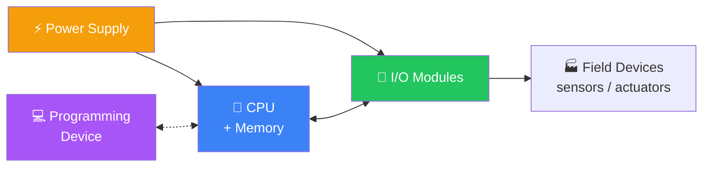

# Sprint 1 Cheat Sheet — Architecture & I/O

## 🧱 The Five Core Blocks



| Block | Role |
|-------|------|
| Power supply | Converts mains to clean low-voltage DC for the controller and field power |
| CPU + memory | Executes the program, holds the I/O image, manages comms |
| I/O modules | Translate field voltages/currents to digital values (and back) |
| Programming device | Used at commission and for diagnostics — usually a laptop |
| Field devices | The physical world: switches, sensors, motors, valves |

## 🔄 The Scan Cycle

```
┌──────────────────────────────────────────────┐
│  1. READ INPUTS — copy every input to RAM    │
│  2. EXECUTE  — run program against input image│
│  3. UPDATE OUTPUTS — write output image to HW│
│  4. HOUSEKEEPING — comms, diagnostics, watchdog│
└──────────────────────────────────────────────┘
```

**Scan time** = time to complete one full loop, typically 1–50 ms.
**Critical insight:** an input pulse shorter than the scan time can be missed.

## 🔌 I/O Types — Quick Reference

| Type | Discrete (digital) | Analog |
|------|--------------------|--------|
| What | On/off, true/false | Continuous value |
| Examples | Limit switch, push button, photoelectric, contactor, solenoid valve | Thermocouple, RTD, pressure transducer, VFD speed reference |
| Signal | 24 VDC, 120 VAC, dry contact | 4–20 mA, 0–10 V, 0–5 V |
| Resolution | 1 bit | 12, 14, or 16 bits typically |

## ⚡ Sourcing vs. Sinking (PNP vs. NPN)

| | Sourcing (PNP) | Sinking (NPN) |
|--|---------------|---------------|
| Where current flows | Out of the sensor into the input | From the input into the sensor |
| Common in | Europe, modern Siemens | Asia, older Allen-Bradley |
| Wiring rule of thumb | Switch on the +24 V side | Switch on the 0 V side |

⚠️ **Mixing them up will silently invert your input or fry the module.** Always match the sensor type to the input module.

## 🎯 Common Field Devices

**Sensors (inputs):**
- Limit switch — mechanical, robust, low-cost
- Inductive proximity — detects metal, no contact
- Capacitive proximity — detects almost anything (including liquids)
- Photoelectric — through-beam, retro-reflective, diffuse
- Encoder — rotary position (incremental or absolute)
- RTD — temperature, very accurate, slow
- Thermocouple — temperature, wide range, less accurate
- Pressure transducer — usually 4–20 mA loop-powered

**Actuators (outputs):**
- Relay output — flexible, slow (~10 ms), wears mechanically
- Transistor output — fast, DC only, high cycle life
- Triac output — AC loads, mid-speed
- Contactor — switches motor power
- Solenoid valve — pneumatic / hydraulic actuation
- VFD — variable speed motor control, takes 4–20 mA or 0–10 V

## 🚨 Top 3 Beginner Mistakes

1. **Picking discrete I/O when you needed analog** — "valve open/closed" might really mean "valve position 0–100%."
2. **Ignoring scan time** — fast events (encoder pulses, button bounces) need either fast scan or specialized high-speed counter modules.
3. **Mixing PNP and NPN sensors on the same input card** — always check the module spec.

## 🔍 Manufacturer Translations

| Concept | Siemens | Allen-Bradley | Mitsubishi |
|---------|---------|---------------|------------|
| Discrete input | DI / E | I:1/0 | X0 |
| Discrete output | DO / A | O:2/0 | Y0 |
| Analog input | AI / PEW | I:3.0 | D100 |
| Internal flag | M / Merker | B3:0/0 | M0 |
