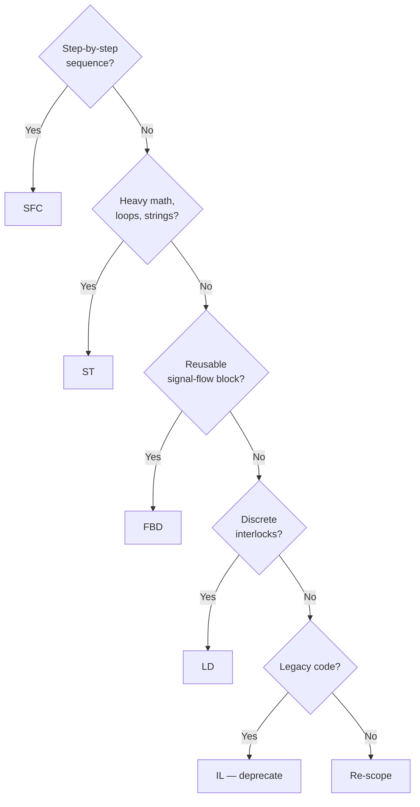

# Sprint 4 Cheat Sheet — IL, ST, SFC

## 📜 The Five IEC 61131-3 Languages

| Language | Style | Best for | Siemens name |
|----------|-------|----------|--------------|
| LD (Ladder Diagram) | Graphical (rungs) | Discrete interlocks, safety | KOP |
| FBD (Function Block Diagram) | Graphical (blocks) | Process control, reusable blocks | FUP |
| IL (Instruction List) | Textual (assembly-like) | Legacy, low-level — being deprecated | AWL |
| ST (Structured Text) | Textual (Pascal-like) | Math, loops, complex conditions | SCL |
| SFC (Sequential Function Chart) | Graphical (steps) | Sequences, batch, recipes | GRAPH |

## 📝 Instruction List (IL) — At a Glance

```
LD   START       (* Load START   *)
ANDN STOP        (* AND with NOT STOP *)
ST   MOTOR       (* Store to MOTOR *)
```

Common operators: `LD`, `ST`, `AND`, `OR`, `ANDN`, `ORN`, `NOT`, `S`, `R`, `JMP`, `CAL`.

⚠️ IEC 61131-3 Edition 3 (2013) deprecates IL. Don't write new code in it. Read it for legacy maintenance.

## 🧮 Structured Text (ST) — Pascal for PLCs

```pascal
(* Variables *)
VAR
    Start    : BOOL;
    Stop     : BOOL;
    Motor    : BOOL;
    Speed    : REAL;
END_VAR

(* Logic *)
IF Start AND NOT Stop THEN
    Motor := TRUE;
END_IF;

IF Stop THEN
    Motor := FALSE;
END_IF;

(* Math + scaling: 4–20 mA → 0–100% *)
Speed := (Current_mA - 4.0) / 16.0 * 100.0;
```

**Operators:**
- Boolean: `AND`, `OR`, `XOR`, `NOT`
- Comparison: `=`, `<>`, `<`, `>`, `<=`, `>=`
- Assignment: `:=`
- Math: `+`, `-`, `*`, `/`, `MOD`, `**` (power)

**Control flow:** `IF…THEN…ELSIF…ELSE…END_IF`, `CASE…OF`, `FOR…TO…DO`, `WHILE…DO`, `REPEAT…UNTIL`, `EXIT`, `RETURN`.

**Data types:** `BOOL`, `INT`, `DINT`, `REAL`, `LREAL`, `TIME`, `STRING`, `ARRAY`, `STRUCT`.

## 🧭 Sequential Function Chart (SFC) — Visual State Machines

An SFC is **steps** (boxes) connected by **transitions** (horizontal bars with conditions). Exactly one step is active at a time per chain.

```
    ┌──────────┐
    │ Step 1   │  ← Initial step (double border)
    │ Idle     │
    └────┬─────┘
         ─── (Start_Button)         ← Transition condition
    ┌────▼─────┐
    │ Step 2   │
    │ Filling  │
    │ N: Pump  │   ← Action (N = Non-stored)
    └────┬─────┘
         ─── (Level >= 80)
    ┌────▼─────┐
    │ Step 3   │
    │ Mixing   │
    │ N: Mixer │
    └────┬─────┘
         ─── (T#30s elapsed)
         ▼
    ... and so on
```

**Action qualifiers:**
- `N` — Non-stored (active while step is active)
- `S` — Set (latches on, must be reset)
- `R` — Reset
- `L` — Limited duration
- `D` — Delayed
- `P` — Pulse (one scan)

## 🌳 Language Decision Tree



## 🔁 Mixing Languages — The Right Move

Real programs use **multiple languages** in different POUs (Program Organization Units):

- **Main program** in SFC for overall flow
- **Per-step actions** in LD or FBD for interlocks
- **Math-heavy function blocks** in ST
- **Safety logic** in LD (auditable)

This is normal. IEC 61131-3 was designed for it.

## 🏷️ Siemens Translation Crib

| IEC 61131-3 | Siemens TIA Portal |
|-------------|--------------------|
| LD | KOP (Kontaktplan) |
| FBD | FUP (Funktionsplan) |
| IL | AWL (Anweisungsliste) — only S7-300/400 classic |
| ST | SCL (Structured Control Language) |
| SFC | GRAPH |
