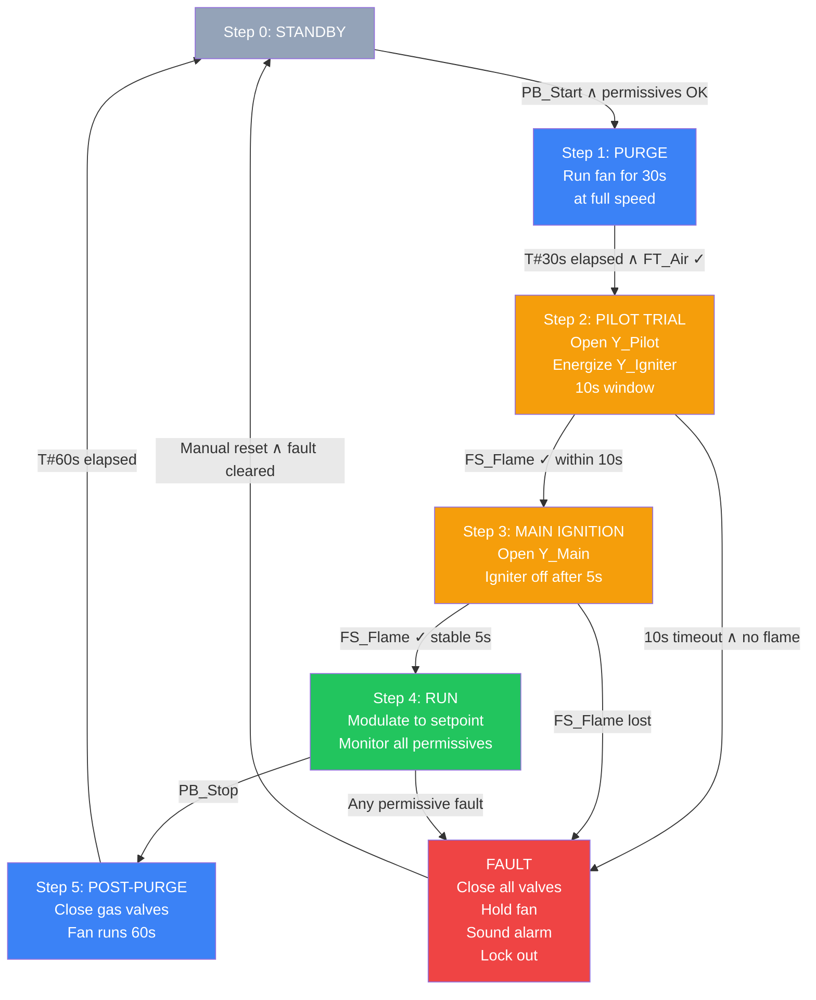

# 🏆 Capstone — Industrial Boiler Burner Start-Up Sequence

> **Bridges:** Sprints 4 (SFC), 5 (timers), 6 (safety) — and is directly applicable to real-world burner management systems and kedelpasser-style industrial training.

---

## 🎯 The Brief

Design and document a complete start-up sequence for a small industrial gas-fired boiler. Your deliverable is a portfolio piece: SFC + structured text + safety logic + documentation.

This is the kind of project a control engineer might present in a job interview. Take your time.

---

## 📋 System Description

A natural-gas-fired steam boiler with the following components:

**Inputs (sensors):**
- `PB_Start` — Start push button (NO)
- `PB_Stop` — Stop push button (NC, fail-safe)
- `PB_EStop` — Emergency stop (NC, dual-channel)
- `PSL_Gas` — Low gas pressure switch (NO when adequate)
- `PSH_Gas` — High gas pressure switch (NC)
- `LSL_Water` — Low water level switch (NO when adequate)
- `LSH_Water` — High water level switch (NC)
- `FT_Air` — Forced-draft fan running feedback
- `FS_Flame` — Flame detection (UV scanner, NO when flame present)
- `PT_Steam` — Steam pressure transducer (4–20 mA, 0–10 bar)
- `TT_Stack` — Stack temperature (4–20 mA, 0–500 °C)

**Outputs (actuators):**
- `Y_Fan` — Forced-draft fan contactor
- `Y_Pilot` — Pilot gas valve
- `Y_Main` — Main gas valve
- `Y_Igniter` — Spark igniter
- `Y_Alarm` — General alarm horn
- `HMI_Status` — Status word to HMI

---

## 🧭 Required Sequence

---

## ✅ Deliverables (in your `/capstone/` folder of the PR)

1. **`README.md`** — system description, sequence of operations, assumptions
2. **`io-list.csv`** — every tag, type, address, fail-safe state
3. **`sfc-diagram.png`**, `.svg`, or a Mermaid source — the SFC drawn out
4. **`main.st`** — the SFC + actions in Structured Text
5. **`safety.st`** — separate safety POU (would normally run on a safety PLC)
6. **`fmea.md`** — at least 10 entries with severity / likelihood / detectability scoring
7. **`test-plan.md`** — how you'd FAT and SAT this system
8. **`reflection.md`** — what was hardest, what surprised you, what would change in real life

---

## 🚦 Grading Rubric (self-assessed)

| Criterion | Weight |
|-----------|--------|
| Sequence correctness — all steps and transitions covered | 20% |
| Safety logic — fail-safe behavior on every fault | 25% |
| Code clarity — comments, naming, structure | 15% |
| FMEA — coverage and quality of mitigations | 15% |
| Documentation — could maintenance read it? | 15% |
| Reflection — honest, specific, useful | 10% |

---

## 💡 Hints

- The pilot trial is the most safety-critical step. If the flame doesn't establish within the trial-for-ignition time (TFI), you **must** lock out — multiple ignition attempts with unburned gas in the firebox cause explosions.
- The pre-purge and post-purge are not optional. Five air changes through the firebox is the standard.
- Emergency stop is hardwired to the gas valves' shutoff coils — it does **not** rely on the PLC alone. The PLC is informed of the E-stop state but cannot override it.
- Burner management systems in industry are usually IEC 61508 SIL 2 or SIL 3 certified. Your code is for portfolio purposes, not actual installation.

---

## 📚 Real-World References

- EN 12952 / EN 12953 — water-tube and shell boilers
- NFPA 85 — boiler and combustion systems hazards (US)
- IEC 61508 — functional safety
- ISO 13577 — safety of industrial furnaces

This capstone is illustrative. A real installation requires a certified burner management system from a vendor like Honeywell, Siemens LMV, or Fireye — never a custom PLC program in the safety path.
